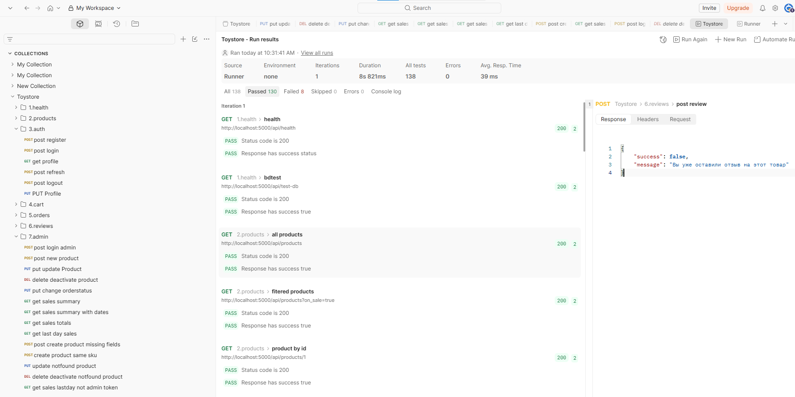
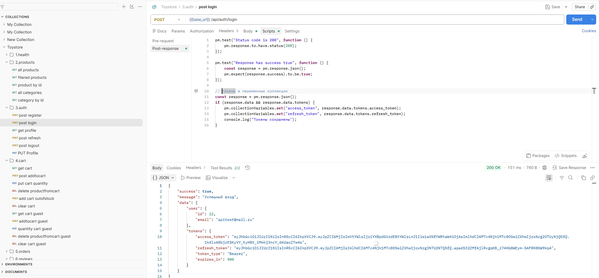

#  Postman Коллекция ToyStore API
Полный набор тестов для REST API интернет-магазина
---
| Показатель | Значение |
|------------|----------|
| **Всего запросов** | 59 |
| **Всего тестов** | 138 |
| **Покрытие эндпоинтов** | 100% |
| **Позитивные сценарии** | 28 |
| **Негативные сценарии** | 31 |

---
### Переменные

| Переменная | Значение по умолчанию | Описание |
|------------|----------------------|----------|
| `base_url` | `http://localhost:5000` | Базовый URL сервера |
| `access_token` | (заполняется автоматически) | JWT токен доступа |
| `refresh_token` | (заполняется автоматически) | JWT токен обновления |
| `user_email` | `apitest@mail.ru` | Email тестового пользователя |
| `user_password` | `apitest` | Пароль тестового пользователя |
| `sessionId` | (генерируется автоматически) | UUID для гостевых запросов |
| `admin_email` | `admintest@mail.ru` | Email тетового администратора |
| `admin_password` | `admintest` | Пароль тестового администратора |
| `admin_access_token` | (заполняется автоматически) | JWT доступа админа |
| `admin_refresh_token` | (заполняется автоматически) | JWT обновления |
| `new_product_id` | (заполняется автоматически) | айди тестового товара |

---
Прогон всех тестов  
  
Пример позитивного теста  
  
Пример негативного теста  
  

