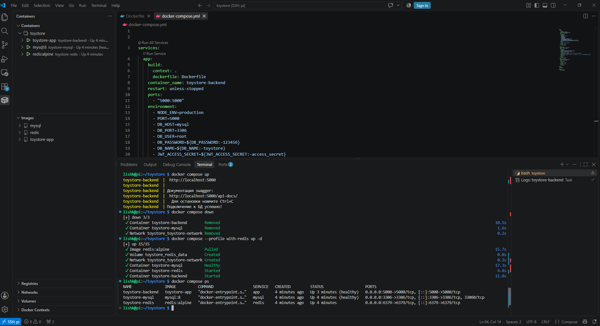

#  ToyStore — Docker + Redis Training

**Цель:** Научиться контейнеризировать Node.js приложение и разворачивать его в любой среде с помощью Docker.

Этот проект — продолжение [предыдущего этапа](../3.%20Toystore%20-%20node.js%20trainig/), где я перенес готовый бэкенд в Docker-контейнеры.


---

## Оглавление

- [Что сделано](#что-сделано)
- [Стек технологий](#стек-технологий)
- [Быстрый запуск](#быстрый-запуск)
- [Локальная установка](#локальная-установка)
- [Структура проекта](#структура-проекта)
- [Docker команды](#docker-команды)
- [Деплой на Raspberry Pi](#деплой-на-raspberry-pi)
- [Что я освоил](#что-я-освоил)

---

##  Что сделано

-  **Многоэтапная сборка** Docker-образа (легковесный финальный образ)
-  **Docker Compose** для оркестрации контейнеров (app + mysql)
- **Healthcheck** для контроля работоспособности сервисов
- **Переменные окружения** через `.env` файл
- **Автоматический импорт** дампа базы данных при первом запуске
- **Готовый к деплою** проект — одна команда для запуска
- **Реальный деплой** на Raspberry Pi 4

---

## Стек технологий

| Компонент | Технология |
|-----------|------------|
| **Среда выполнения** | Node.js 22 (Alpine) |
| **Веб-фреймворк** | Express 4.18|
| **База данных** | MySQL + Redis|
| **Контейнеризация** | Docker + Docker Compose |
| **Платформа деплоя** | Raspberry Pi 4 |
| **Документация** | Swagger (OpenAPI) |

---

## Быстрый запуск

```bash
# 1. Клонировать репозиторий
git clone https://github.com/nshveykus/portfolio.git
cd portfolio/"4. Toystore - Docker training"

# 2. Скопировать .env и заполнить
cp .env.example .env

# 3. Запустить всё одной командой
docker compose --profile with-redis up -d
```

**Результат:**
- Эндпоинты: http://localhost:5000
- Swagger UI: http://localhost:5000/api-docs
- MySQL: localhost:3306
- Redis: localhost:6379

---

##  Локальная установка

Если вы хотите запустить проект без Docker:

```bash
# 1. Установить зависимости
npm install

# 2. Создать .env
cp .env.example .env

# 3. Создать базу данных
mysql -u root -p < mysql/toystore_backup.sql

# 4. Запустить
node index.js
```

---

## Структура проекта

```
4. Toystore - Docker training/
├── Dockerfile              # Многоэтапная сборка образа
├── docker-compose.yml      # Оркестрация контейнеров
├── .dockerignore           # Что НЕ копировать в образ
├── .env.example            # Шаблон переменных окружения
├── index.js                # Точка входа
├── swagger.js              # Генерация документации
├── swagger-output.json     # Сгенерированная документация
├── db.js                   # Подключение к MySQL
├── package.json            # Зависимости
├── mysql/
│   └── toystore_backup.sql # Дамп базы данных
└── src/
    ├── controllers/        # Бизнес-логика
    ├── models/             # Работа с БД
    ├── routes/             # Маршруты API
    ├── middlewares/        # Аутентификация
    └── scripts/            # Утилиты
```

---

## Docker команды

### Сборка и запуск

```bash
# Собрать образ и запустить контейнеры без redis
docker compose up -d

# Собрать образ и запустить контейнеры с redis
docker compose --profile with-redis up -d

# Собрать образ без кэша (принудительно)
docker compose build --no-cache

# Пересобрать и запустить
docker compose up -d --build
```


## Деплой на Raspberry Pi

Проект успешно развернут на Raspberry Pi 4 с 4GB RAM под управлением Raspberry Pi OS (64-bit). Контейнеры запущены через Docker Compose и работают стабильно.

### Технические детали:

| Параметр | Значение |
|----------|----------|
| **Платформа** | Raspberry Pi 4 |
| **ОС** | Raspberry Pi OS (64-bit) |
| **Docker** | Docker CE |
| **Порты** | 5000 (API), 3306 (MySQL), 6379(Redis) |


## Redis: Кеширование, Rate Limiting и отказоустойчивость

В рамках развития проекта я интегрировал Redis — высокопроизводительное in-memory хранилище. Это позволило значительно ускорить работу API, защитить сервер от перегрузок и реализовать отказоустойчивую систему хранения refresh-токенов.
### Что реализовано:
#### 1. Кеширование GET-запросов (Cache-Aside)

- Кешируются ответы на GET-запросы к API (списки товаров, категории, детали товара).
- Время жизни кеша (TTL) настраивается индивидуально для каждого эндпоинта.
Автоматическая инвалидация кеша при изменении данных (создание, обновление, удаление товаров).
- При первом запросе данные загружаются из MySQL и сохраняются в Redis; все последующие запросы возвращаются из кеша.

#### 2. Rate Limiting (Ограничение частоты запросов)
- Защита API от DDoS-атак и ботов.
- Настраиваемый лимит: по умолчанию 100 запросов в минуту с одного IP-адреса.
- При превышении лимита возвращается HTTP 429 Too Many Requests.
- Используется атомарная операция INCR для точного подсчёта в распределённой среде.
#### 3. Гибридное хранение Refresh-токенов (Redis + MySQL)
- Refresh-токены хранятся одновременно в Redis (для быстрого доступа) и MySQL (как резервное хранилище).
- При падении Redis система автоматически переключается на MySQL без потери функциональности.
- При восстановлении Redis данные синхронизируются.
#### 4. Отказоустойчивость
- Все запросы к Redis обёрнуты в try/catch с graceful fallback.
- Если Redis недоступен:

    - Кеширование отключается (данные читаются напрямую из MySQL).  

    - Rate Limiting отключается (запросы проходят без ограничений).  

    - Токены читаются из MySQL.  

- При восстановлении Redis все функции автоматически возобновляются.

Сервис сохраняет 100% доступность даже при падении Redis.
### Технические детали
| Компонент | Технология |
|-----------|------------|
| **Redis-клиент** | ioredis |
| **Контейнеризация** | Redis в Docker-контейнере |
| **Структуры данных** | Strings (кеш, токены), атомарные счетчики |
| **Стратегия кеширования** | Cache-Aside с TTL 300-600 секунд |
| **Паттерны** | Singleton для подключения, Middleware для кеша и лимитов |


## Что я освоил

| Навык | Описание |
|-------|----------|
| **Dockerfile** | Написание Dockerfile с многоэтапной сборкой |
| **Docker Compose** | Оркестрация нескольких контейнеров |
| **Переменные окружения** | Безопасное хранение настроек |
| **Healthcheck** | Настройка проверки работоспособности |
| **Тома (Volumes)** | Сохранение данных БД |
| **Сети (Networks)** | Взаимодействие контейнеров |
| **Деплой на RPi** | Развертывание на Raspberry Pi 4 |
| **NoSQL базы данных** | Понимание принципов работы in-memory хранилищ |
| **Redis структуры данных** | Strings, атомарные операции (INCR) |
| **TTL (Time To Live)** | Автоматическое удаление устаревших данных |
| **Cache-Aside паттерн** | Кеширование с инвалидацией |
| **Rate Limiting** | Защита API с помощью атомарных счётчиков |
| **Гибридное хранение** | Redis + MySQL для надёжности и скорости |
| **Отказоустойчивость** | Fallback-механизмы при падении Redis |
| **Middleware в Express** | Кеширование и лимиты на уровне маршрутов |
| **Singleton паттерн** | Единое подключение к Redis для всего приложения |
---
## Дальнейшие планы  

Jest, автоматизация тестирования